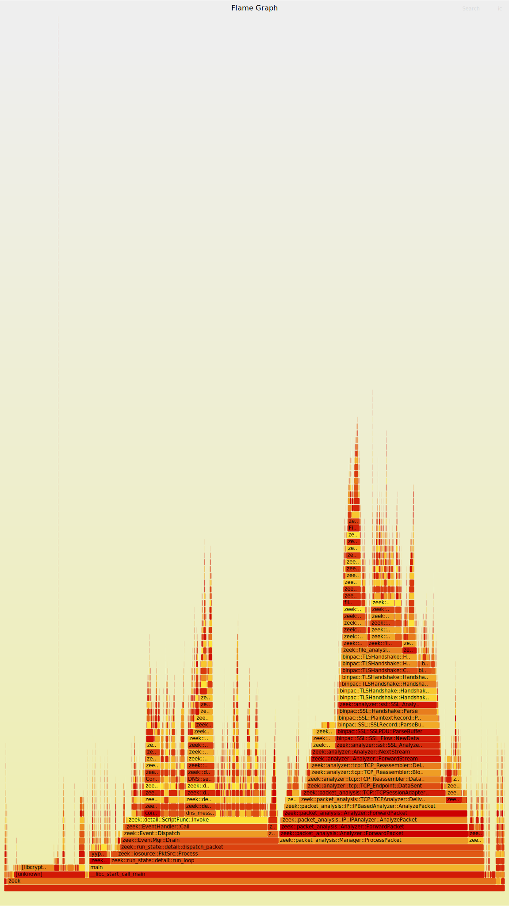

Zeek PerfSupport
================

Replaces `ScriptFunc` top-level bodies Stmts with a Stmt class that diverts execution
through a trampoline (minimal JITing) and produces `/tmp/perf-<pid>.map` files.

Not enabled by default. Run with:

    perf record -g zeek -r ./trace.pcap PerfSupport::enable=T

or

    ZEEKPERFSUPPORT=1 perf record -g zeek -r ./trace.pcap

To prefix the functions in the map file "ZEEK:", can redef `PerfSupport::prefix="ZEEK:"`.

There's an artificial `_Zeek_PerfSupport_stmt_exec` function in the callbacks, filter
out with `grep` ;-)

    perf script | grep -v '_Zeek_PerfSupport' | stackcollapse-perf.pl |  flamegraph.pl > flame.svg

